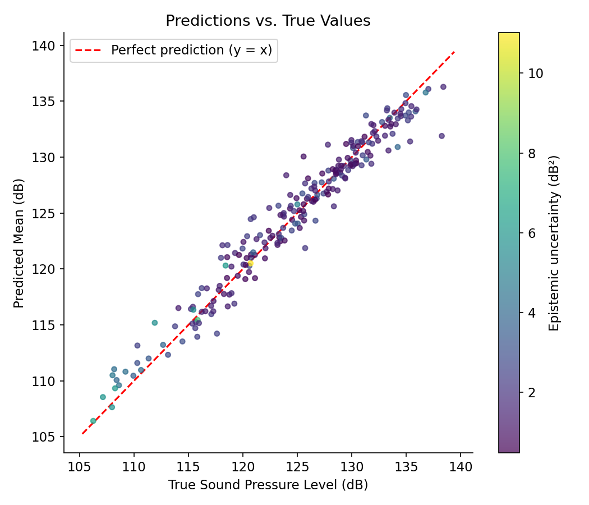
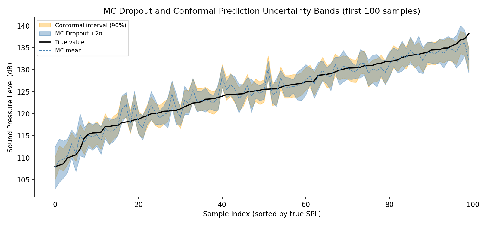
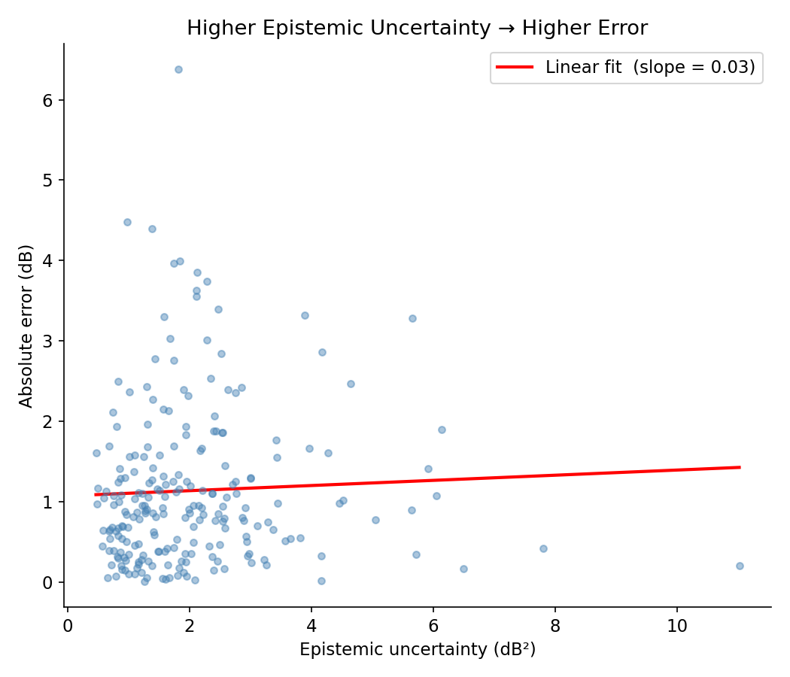
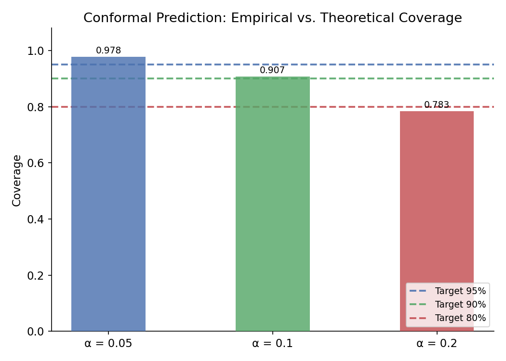

# UQ on NASA Airfoil Surrogate: MC Dropout + Conformal Prediction with coverage guarantees.

Neural network surrogate model on the NASA Airfoil Self-Noise dataset with uncertainty quantification via MC Dropout and Conformal Prediction.

---

## Motivation

Physics-based simulations are computationally expensive, so practitioners replace them with fast surrogate (emulator) models.
In safety-critical engineering contexts — aerodynamics, structural analysis, material design — a surrogate that only returns a point prediction is not enough: we need to know *how much to trust* that prediction.
Uncertainty quantification (UQ) turns the surrogate from a black box into a calibrated tool, flagging regions of input space where the model is extrapolating and providing statistically valid prediction intervals that support decision-making under uncertainty.

---

## Methods

### MC Dropout

MC Dropout treats Dropout layers — normally disabled at inference time — as a Bayesian approximation over the network weights.
At inference, Dropout is re-enabled so that each forward pass samples a different random set of neurons, effectively drawing a sample from an approximate posterior over model parameters.
By running many such stochastic passes and collecting the resulting predictions, we obtain an ensemble whose spread captures *epistemic* (model) uncertainty: inputs in well-observed regions produce tight ensembles, while inputs far from the training distribution produce wide ones.
The predictive mean is taken as the point prediction, the variance across the ensemble is the epistemic uncertainty, and the average spread of each individual run across the dataset approximates the aleatoric (data-noise) component.
Because this method requires no changes to the training procedure — only a flag flip at test time — it is extremely cheap to add to any existing Dropout-regularised network.

### Conformal Prediction

Split Conformal Prediction provides *distribution-free*, finite-sample coverage guarantees: if the data are exchangeable, the resulting interval contains the true value with probability at least 1 − α, regardless of the underlying data distribution or model quality.
The method works in two stages: first, a held-out calibration set is used to compute nonconformity scores — here the absolute residual |y − ŷ| — and a quantile q̂ at level ⌈(n+1)(1−α)⌉/n is extracted from these scores.
At test time, the prediction interval for any new point is simply [ŷ − q̂, ŷ + q̂]: a symmetric band of fixed half-width around the model's point prediction.
Because q̂ is derived from real residuals on held-out data, the interval automatically adapts to how well (or poorly) the model fits the problem — a bad model produces large residuals, which widen the intervals until coverage is satisfied.
Unlike MC Dropout, Conformal Prediction makes no assumptions about the model architecture and can wrap any black-box predictor.

---

## Results

### 01 — Predictions vs. True Values

Points coloured by epistemic uncertainty; the red dashed line marks perfect prediction.
High-epistemic points (yellow) tend to appear where the model struggles most.



---

### 02 — Uncertainty Bands

First 100 test samples sorted by true sound pressure level.
The light-blue band is the MC Dropout ±2σ interval; the orange band is the 90 % conformal interval.



---

### 03 — Epistemic Uncertainty vs. Absolute Error

Each point is one test sample.  The positive-slope regression line confirms that higher epistemic uncertainty is a reliable proxy for higher prediction error.



---

### 04 — Coverage Calibration

Bars show empirical coverage on the test set; dashed lines show the theoretical target for each α.
Conformal Prediction reliably meets or exceeds the nominal coverage, validating the calibration procedure.



---

## How to Run

```bash
# 1. Install dependencies (CPU PyTorch; for GPU see pytorch.org/get-started)
pip install -r requirements.txt

# 2. Download the NASA Airfoil dataset from UCI
python data/download_data.py

# 3. Train the surrogate model (saves checkpoints/best_model.pt)
python train.py

# 4. (Optional) standalone UQ demos
python uq_inference.py
python conformal.py

# 5. Generate all four figures in results/
python visualize.py
```

> **GPU note** — `train.py` auto-detects CUDA.  
> For GPU PyTorch replace the `torch` line in `requirements.txt` with the wheel from <https://pytorch.org/get-started/locally/>.

---

## Project Structure

```
uq-airfoil-surrogate/
├── data/
│   └── download_data.py      # downloads airfoil_self_noise.dat from UCI
├── model.py                  # MLP with enable_mc_dropout()
├── train.py                  # training loop, saves best checkpoint + scalers
├── uq_inference.py           # MC Dropout → mean / std / epistemic / aleatoric
├── conformal.py              # Split Conformal Prediction → calibrated intervals
├── visualize.py              # generates all four figures
├── results/                  # output figures (auto-created)
├── checkpoints/              # saved model (auto-created by train.py)
├── requirements.txt
└── README.md
```

---

## Dataset

**NASA Airfoil Self-Noise** — UCI ML Repository  
1503 samples, 5 aeroacoustic features → target: sound pressure level (dB).  
Features: frequency (Hz), angle of attack (°), chord length (m), free-stream velocity (m/s), suction-side displacement thickness (m).
